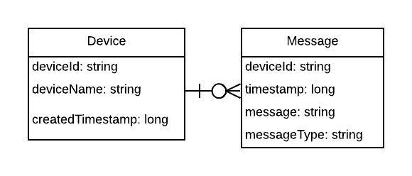

# AWS AppSync GraphQL API

This repo contains an example implementation of a GraphQL API for an IoT Device Messaging System. It is 
built with [AWS Appsync](https://aws.amazon.com/appsync/) and using Typescript lambda functions as resolvers and DynamoDB as a data source. 

The models exposed via the API are Devices and Messages:



An example use case for the API would be an admin console for managing IoT Devices and viewing messages. The API could
be expanded upon to provide realtime message updates for Devices using Appsync/GraphQL subscriptions.

## Requirements

* AWS CLI already configured with Administrator permission
* [nodejs10.x installed](https://nodejs.org/en/download/releases/)
* [Docker installed](https://www.docker.com/community-edition)
* Typescript installed

## Packaging and deployment

An S3 bucket must be created before deployment to hold the lambda code:

```
aws s3 mb s3://BUCKET_NAME
```

Set the follow environment variables:
```
export S3_BUCKET=
export STACK_NAME=
```

```
# Package and Build
make

# Deploy
make deploy
```

#### Packaging notes:
- The `devDependencies` are installed in order for `tsc` to compile the TypeScript code to Javascript
- The dev `node_modules` are then removed and the production dependencies are installed and zipped in the lambda package

## Testing

The GraphQL lambdas can be tested locally using the [Amazon DynamoDB docker image](https://hub.docker.com/r/amazon/dynamodb-local).

To execute unit tests, run:
```
export DYNAMODB_TABLE=TestTable
make test
```

This will:
- Set the table name env var available to Jest  
- Launch the dynamodb docker image in a separate process with `port 8000` mapped  
- Execute unit tests. Before tests execute a dynamodb table is created in the docker image  
- Stops and removes the dynamodb image after test execution  

## Example Queries

```
mutation {
      storeMessage(
        deviceId: "D123", 
        message: "An anomaly was detected",
        messageType: "Alert"
      ) {
    deviceId,
    timestamp
  }
}

Returns:
{
  "data": {
    "storeMessage": {
      "deviceId": "D123",
      "timestamp": 1558052249959,
    }
  }
}

query {
  getMessage(deviceId: "F123", timestamp: 1558052249959) {
   message,
   messageType
  }
}

# See all messages for the device
query {
  allMessages(deviceId: "D123") {
   message
  }
}

Returns:
{
  "data": {
    "allMessages": [
      {
        "message": "An anomaly was detected"
      },
      {
        "message": "Everything is fine"
      }
    ]
  }
}

# See all messages for the device
query {
  getDevice(deviceId: "D123") {
    deviceName,
    messages {
      timestamp,
      message
    }
  }
}
```